# Zoom Momentum

A Zoom Apps SDK in-meeting side panel app that transforms passive virtual classrooms into active learning environments. Built as part of the **Zoom Fellowship**.

Momentum gives professors real-time engagement tools and gives students a dynamic topic timeline, glossary, live transcript, and post-class review — all powered by AI.

The full engineering breakdown is in [`docs/technical-deep-dive.md`](docs/technical-deep-dive.md).

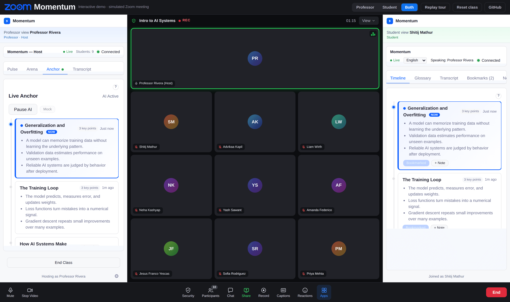

*In a real meeting the panel docks on the right for everyone — shown side by side here, the professor's panel on the left and a student's on the right, so you can see both at once. [Try it live →](https://zoom-momentum.vercel.app/demo)*

---

## How It Works

Zoom Momentum is a **single app** installed once on the Zoom Marketplace. When a participant opens it from the Apps panel during a meeting, the app detects their role automatically:

- **Host / Co-host** sees the **Host Dashboard** with controls to launch polls, start trivia games, monitor AI-powered live analysis, and view the live transcript.
- **Participants** see the **Student View** with a topic timeline, glossary, live transcript, bookmark button, and receive polls/trivia from the host in real time.

Both views are served from the same URL. The Zoom SDK provides the user's role via `getUserContext()`, and the app renders the appropriate interface.

---

## Features

### Professor's Pulse (Host only)

Check-in polls that let the professor gauge student understanding at any point during the lecture.

- Enter optional context (e.g., "We just covered supply and demand")
- AI generates a relevant multiple-choice question
- Professor previews and can edit before launching
- Students see a modal overlay, select an answer, and submit
- Professor ends the poll and results are shown as a bar chart

<p align="center">
  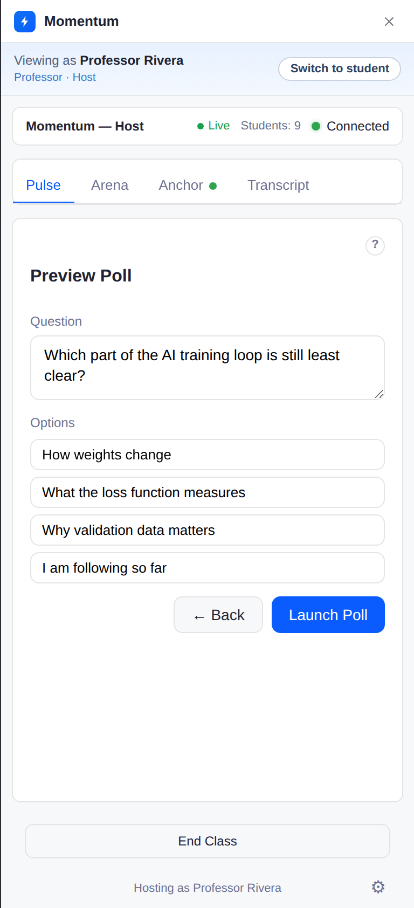
  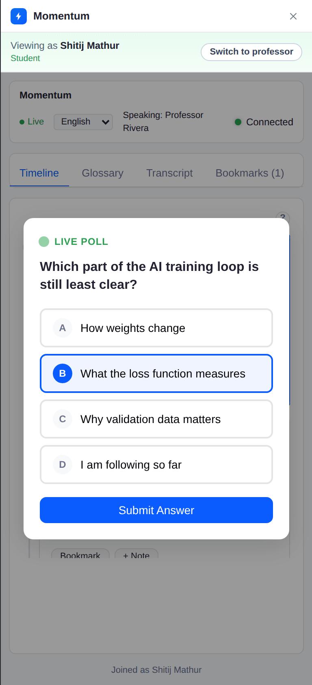
  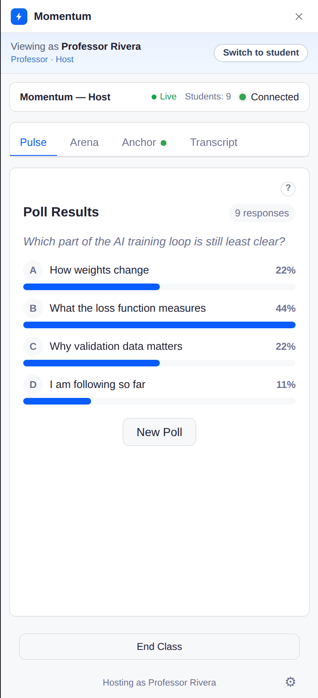
</p>

*AI drafts the poll (professor) → it lands on every student's panel → results tally the moment it closes.*

### Arena (Host launches, students participate)

A timed trivia game for reviewing material.

- Professor enters a topic and AI generates quiz questions from the lecture transcript
- Each question has a 10-second countdown timer
- Students answer in real time and are scored (base points + speed bonus)
- Leaderboard updates after each question
- Professor can end the quiz at any time
- Student overlay stays visible between questions

<p align="center">
  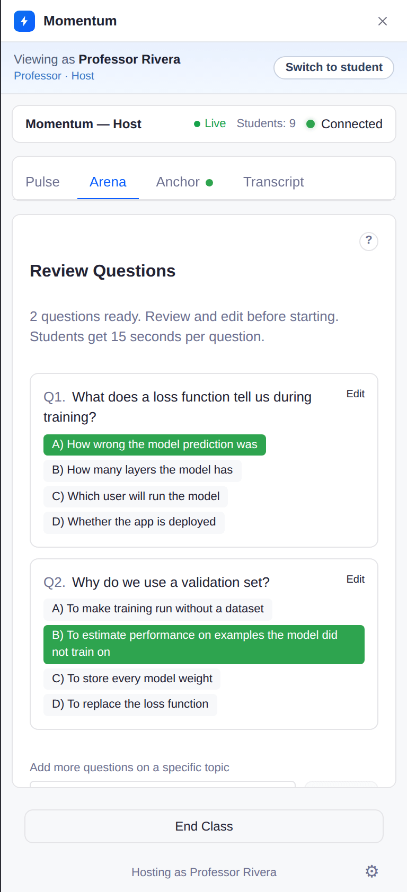
  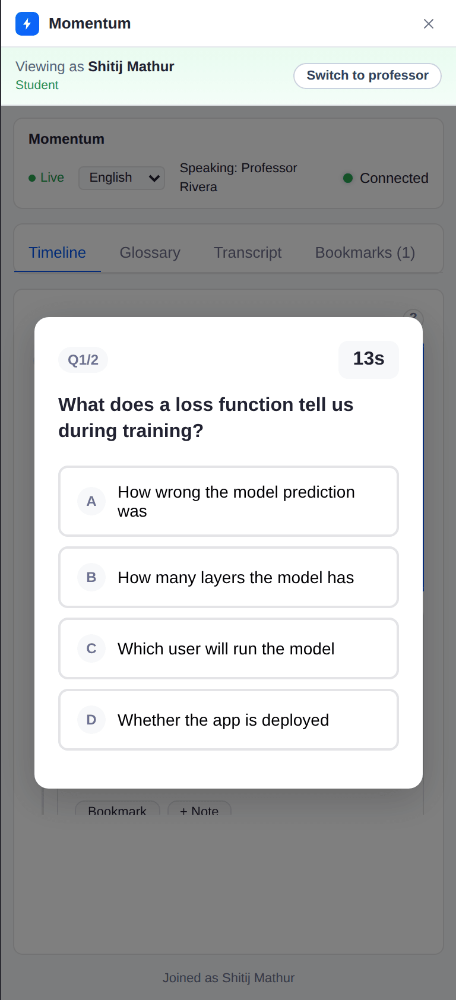
  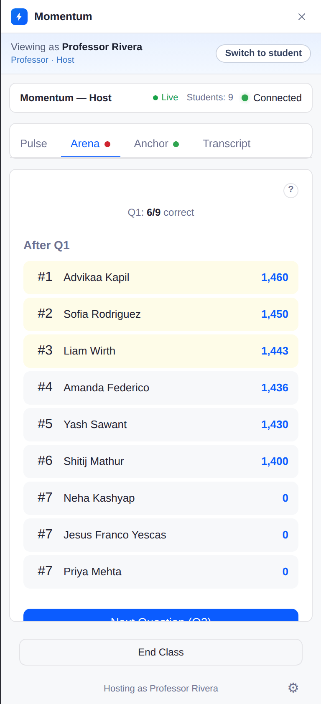
</p>

*Review the AI-written questions (professor) → students race the countdown → live leaderboard with per-question accuracy.*

### Live Anchor (Automatic for all participants)

AI-powered real-time topic timeline, glossary, and live transcript built from RTMS transcription.

- Host clicks "Start AI" which triggers Zoom RTMS live transcription
- AI polls the transcript buffer every 30 seconds, detecting topic changes
- Topic cards appear with bullet-point takeaways
- Technical terms and definitions are extracted into a searchable glossary
- Both host and students see the live transcript with glossary term highlighting
- Inside Zoom: toggle between Live (RTMS) and Mock transcript sources

<p align="center">
  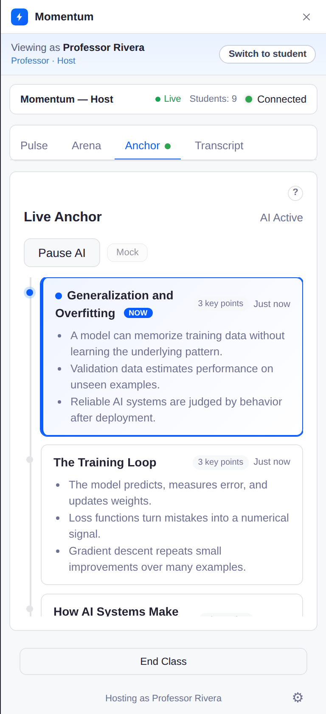
  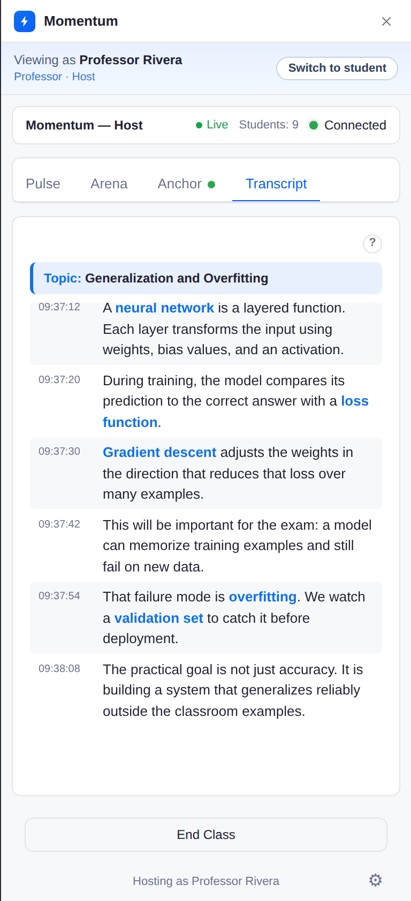
  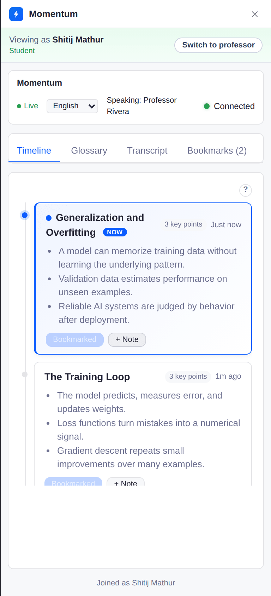
  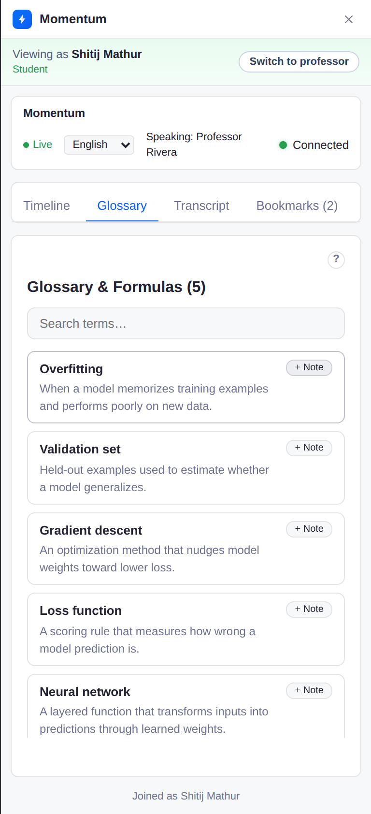
</p>

*The topic timeline and live transcript (professor) — and the same timeline plus a self-writing glossary on the student side, translatable into six languages.*

### Recovery Pack (Post-class, student-facing)

Personalized post-class review based on moments the student bookmarked during the lecture.

- During the lecture, students can tap "Mark for Review" to bookmark the current topic
- AI detects emphasis cues and auto-bookmarks important moments
- When the class ends, the app generates a Recovery Pack with:
  - Plain-language explanation of each confusing topic
  - A practice problem
  - A suggested external resource

<p align="center">
  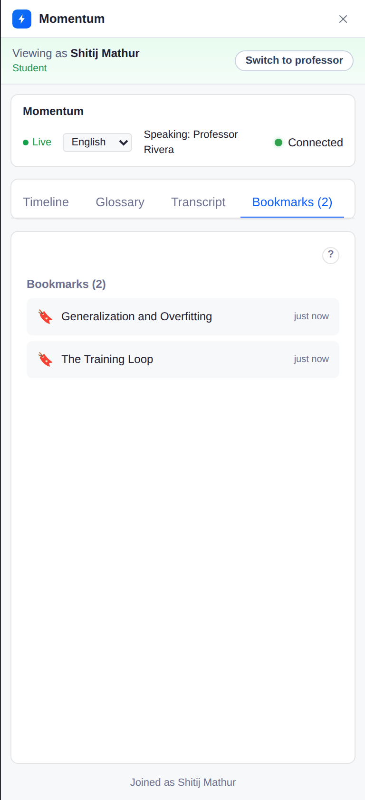
  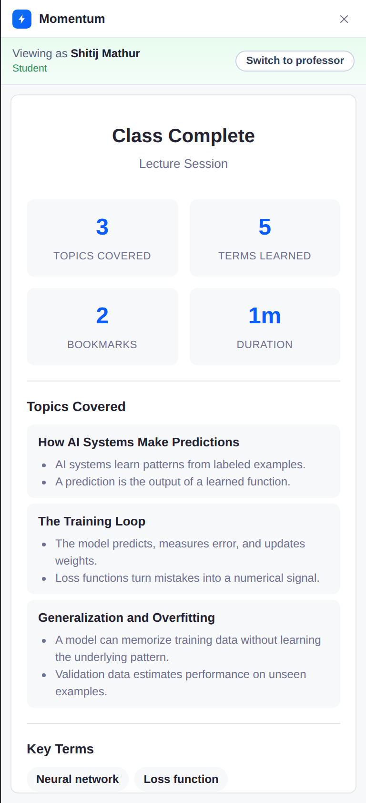
  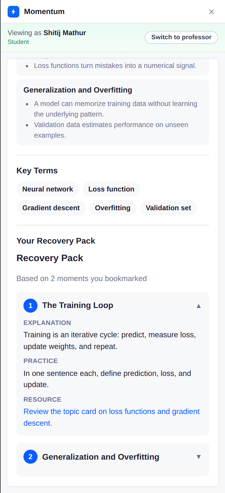
</p>

*Bookmarks captured during class → an instant end-of-class summary → a recovery pack built from every bookmarked moment.*

### Smart Notes (Student)

A notes panel that assembles itself from the class.

- Type free-form notes during the lecture (autosaved locally)
- Tap "+ Note" on any topic card, glossary term, or bookmark to capture it as Markdown
- Download the full set — notes, topics, terms, and bookmarks — as a `.md` file

<p align="center">
  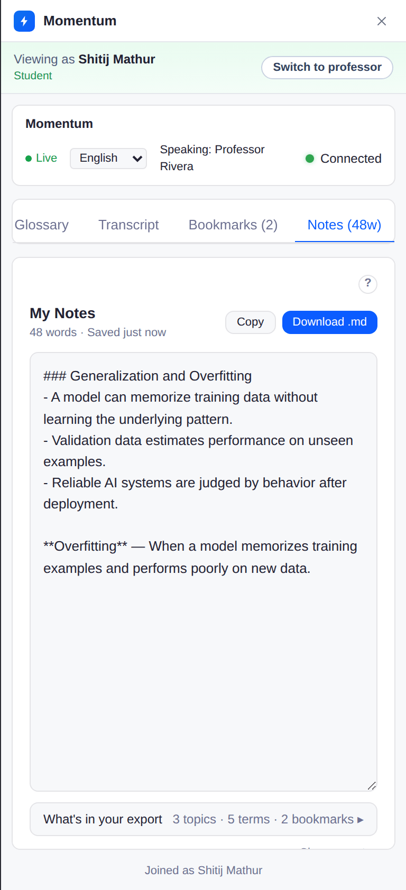
</p>

---

## Host vs. Student View

| Capability | Host | Student |
|---|---|---|
| Launch polls | Yes | No (receives and answers) |
| Start trivia game | Yes | No (receives and plays) |
| Control AI anchor | Yes (start/stop) | No (receives updates) |
| Topic timeline | Yes | Yes |
| Glossary | Yes | Yes (searchable) |
| Live transcript | Yes | Yes (with glossary highlighting) |
| Bookmark moments | No | Yes (Mark for Review) |
| Post-class recovery pack | No | Yes |
| View poll/trivia results | Yes (aggregate) | Yes (own results) |

---

## Architecture

Momentum is one npm monorepo — a React client, an Express server, and a mock-transcript dev utility. The client renders either the Host Dashboard or the Student View from the same bundle. Everything else lives on a single Node process: the REST API, a WebSocket relay that keeps host and students in sync, the Zoom RTMS transcript pipeline, and a tiered AI client that fails over across providers so one outage can't take a class down.

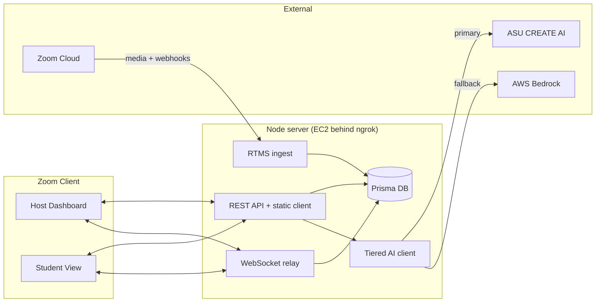

The host and students never talk directly — every message goes through the relay, keyed by meeting ID, with sequence-numbered envelopes so state converges over flaky connections. The AI client is the only thing that talks to model providers, so failover and caching live in one place.

**For the full engineering story** — the sync model, the RTMS two-UUID bug, the AI failover chain, translation caching, and the EC2 deployment, all with diagrams — see [`docs/technical-deep-dive.md`](docs/technical-deep-dive.md).

---

## Demo Mode

When accessed outside of Zoom (in a regular browser), the app auto-detects **demo mode**:

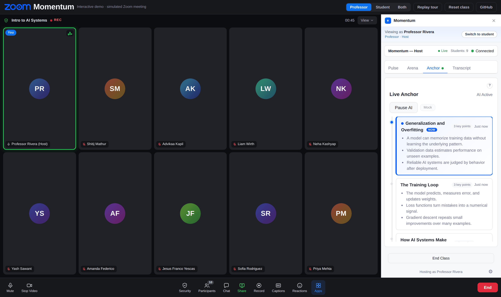

- Full real app UI (not a separate simulation)
- Role switcher in the blue banner (Host / Student)
- Simulation buttons: Late Join, Meeting End, Speaker
- Mock CS50 transcript data (requires mock-transcript service)
- WebSocket messaging works between browser tabs
- Open two tabs to test host↔student interaction

---

## Deployment

The app runs on an **EC2 instance** with a static ngrok tunnel for development.


### Zoom Marketplace Configuration

- **Home URL:** `https://your-tunnel.ngrok-free.dev`
- **Redirect URL:** `https://your-tunnel.ngrok-free.dev/api/auth/callback`
- **Webhook URL:** `https://your-tunnel.ngrok-free.dev/api/rtms/webhook`
- **RTMS:** Enabled (1-year trial through Feb 2027)
- **OAuth Scopes:** `zoomapp:inmeeting`, `meeting:read:meeting`, `user:read`

### Environment Variables

| Variable | Description |
|---|---|
| `ZOOM_CLIENT_ID` | From Zoom Marketplace app |
| `ZOOM_CLIENT_SECRET` | From Zoom Marketplace app |
| `ZOOM_REDIRECT_URL` | OAuth callback URL (must match Marketplace) |
| `ZOOM_SECRET_TOKEN` | For RTMS webhook HMAC verification |
| `SESSION_SECRET` | Random secret for express-session |
| `DATABASE_URL` | `file:./dev.db` (SQLite) or PostgreSQL connection string |
| `AWS_REGION` | AWS region for Bedrock (`us-east-1`) |
| `CREATE_AI_API_URL` | ASU CREATE AI endpoint (optional) |
| `CREATE_AI_TOKEN` | CREATE AI auth token (optional) |
| `CREATE_AI_PRIMARY_MODEL` | Primary model, e.g. `claude4_5_sonnet` (optional) |
| `CREATE_AI_PRIMARY_PROVIDER` | Primary model provider, e.g. `aws` (optional) |
| `CREATE_AI_BACKUP_MODEL` | Backup model, e.g. `gpt5` (optional) |
| `CREATE_AI_BACKUP_PROVIDER` | Backup model provider, e.g. `openai` (optional) |
| `PORT` | Server port (default: 3001) |
| `CLIENT_URL` | Frontend URL (default: `http://localhost:5173`) |

---

## Local Development

### Prerequisites

- Node.js 20+

### Setup

```bash
# 1. Install dependencies
npm install

# 2. Configure environment
cp .env.example .env
# Fill in credentials (see Environment Variables above)

# 3. Initialize the database
cd server && npx prisma migrate dev --name init && cd ..

# 4. Start development servers
npm run dev:mock   # client + server + mock transcript
```

### Commands

| Command | Description |
|---|---|
| `npm run dev` | Start client (5173) + server (3001) |
| `npm run dev:mock` | Same + mock transcript service |
| `npm run build` | Production build |
| `npm run db:migrate -w server` | Run Prisma migrations |
| `npm run db:studio -w server` | Open Prisma Studio |

### Testing in Zoom

```bash
# 1. Build production client
npm run build -w client

# 2. Start ngrok (must point to port 3001)
ngrok http 3001 --url=your-tunnel.ngrok-free.dev

# 3. Start server (serves API + static client build)
npm run dev -w server

# 4. Optionally start mock transcript
npm run dev -w mock-transcript
```

### Testing in Browser (Demo Mode)

```bash
# Start server + mock transcript
npm run dev -w server
npm run dev -w mock-transcript

# Open http://localhost:3001 — demo mode auto-enables
# Open a second tab for student view
```

---

## Project Structure

```
zoom-momentum/
  client/                          # React frontend (Zoom App)
    src/
      App.tsx                      # SDK init, auth, welcome, role routing, demo mode
      views/
        WelcomeView.tsx            # Post-auth onboarding screen
        HostDashboard.tsx          # Host: Pulse + Arena + Anchor + Transcript
        StudentView.tsx            # Student: Timeline + Glossary + Transcript
      components/
        pulse/                     # Poll creator, card, results
        arena/                     # Quiz host, student, leaderboard
        anchor/                    # Topic card, timeline, glossary, transcript
        recovery/                  # Recovery pack, post-class summary
      hooks/
        useZoomSdk.ts              # SDK config, role detection, RTMS, participant count
        useZoomAuth.ts             # OAuth PKCE flow
        useMessaging.ts            # WebSocket relay client with auto-reconnect
        usePulse.ts                # Poll state (host + student)
        useArena.ts                # Trivia state (host + student)
        useLiveAnchor.ts           # Topic timeline + transcript polling
        useDemoMode.ts             # Auto-detect demo mode outside Zoom
        useZoomEvents.ts           # Active speaker, meeting end, late joiner
      types/
        messages.ts                # Message types + app state

  server/                          # Express backend
    src/
      server.ts                    # Express app + WebSocket server + security headers
      config.ts                    # Environment variable validation
      db.ts                        # Shared PrismaClient singleton
      ai-client.ts                # Tiered AI client (CREATE AI -> Bedrock)
      routes/
        auth.ts                    # Zoom OAuth PKCE
        ai.ts                      # AI endpoints (poll, quiz, topic, recovery, cues)
        transcript.ts              # Transcript storage + rolling buffer
        bookmarks.ts               # Bookmark CRUD
        rtms.ts                    # RTMS webhook receiver
      services/
        websocket.ts               # WebSocket relay (rooms by meetingId)
        rtms-ingest.ts             # RTMS stream client + transcript storage
        meeting-resolver.ts        # Auto-create Meeting records from Zoom UUIDs
    prisma/
      schema.prisma                # Database schema

  mock-transcript/                 # Dev-only mock RTMS service (CS50 lecture data)
```

## Tech Stack

| Layer | Technology |
|---|---|
| Frontend | React 18 + Vite + TypeScript |
| Backend | Express + TypeScript + Prisma |
| Database | SQLite (dev) / PostgreSQL (prod) |
| AI | ASU CREATE AI (claude4_5_sonnet/gpt5) + AWS Bedrock fallback |
| Messaging | WebSocket relay through Express |
| Transcript | Zoom RTMS (real-time media streams) |
| Hosting | EC2 (dev via ngrok tunnel) |
| SDK | Zoom Apps SDK (CDN `window.zoomSdk`) |

---

## Status


### Done

- [x] Zoom OAuth PKCE authentication
- [x] Host/student role detection and routing
- [x] Professor's Pulse — AI poll generation, preview/edit, launch, results
- [x] Arena — AI quiz generation, 10s countdown, scoring, leaderboard, host can end anytime
- [x] Live Anchor — AI transcript analysis, topic timeline, searchable glossary
- [x] Live Transcript Tab — host + student, glossary term highlighting
- [x] Recovery Pack — bookmarks, post-class summary, AI recovery pack
- [x] Auto-bookmark broadcast — AI cue detection
- [x] WebSocket messaging — replaced SDK messaging, tested in Zoom
- [x] RTMS integration — Start AI triggers live transcription, tested end-to-end
- [x] Demo mode — auto-enabled outside Zoom, role switcher, sim buttons
- [x] AI backend — CREATE AI with Bedrock fallback
- [x] Prisma singleton, AI error handling, topic dedup (fuzzy matching)
- [x] Meeting ID sync — `getMeetingUUID()` for consistent host/attendee IDs
- [x] Mock transcript service (real CS50 Lecture 0 from Harvard CDN)
- [x] Test framework (Vitest) and linter (ESLint)
- [x] WebSocket auth hardening (session cookie validation)
- [x] Bug fixes — BigInt serialization, participant count, startup race, sign-in button

### Remaining

- [ ] Guest mode testing (second Zoom account)
- [ ] Production database (PostgreSQL)
- [ ] CI/CD pipeline
- [ ] HTTPS on EC2

---

## Author

**Shitij Mathur**
Zoom Fellowship, ASU

---

## License

This project is part of the Zoom Fellowship program at Arizona State University's Next Lab.
