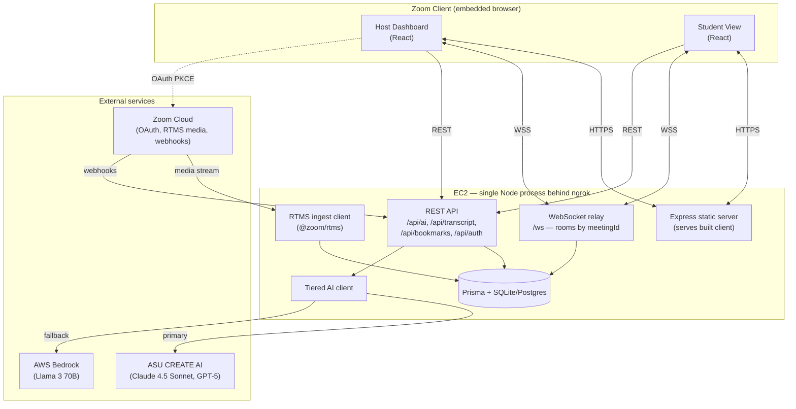
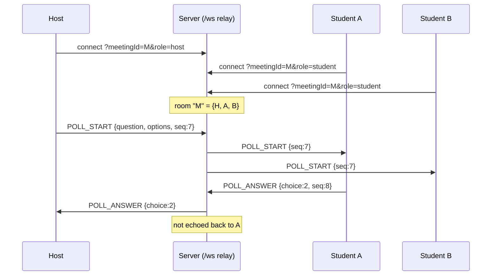
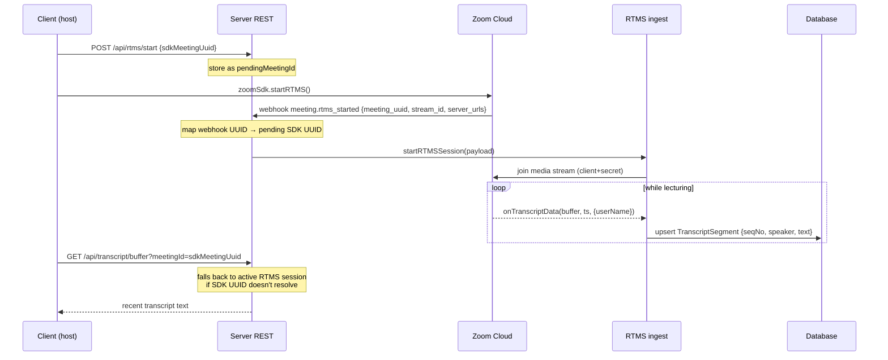
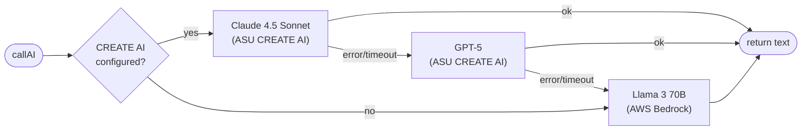
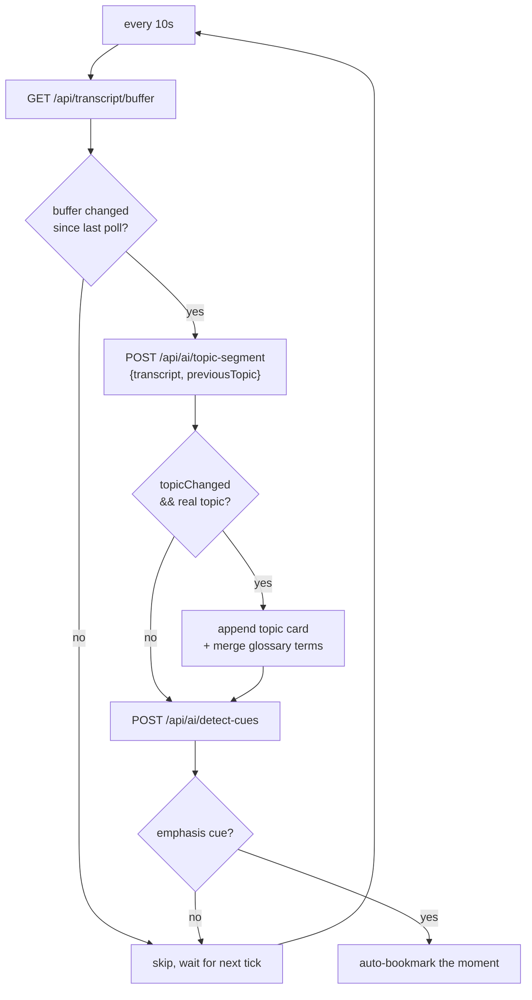
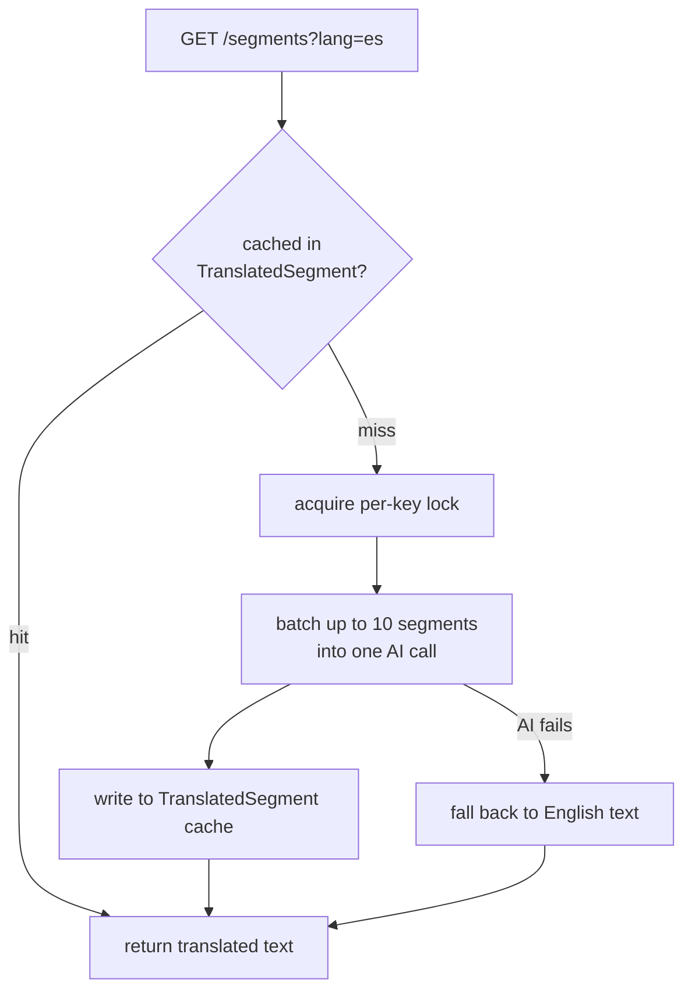
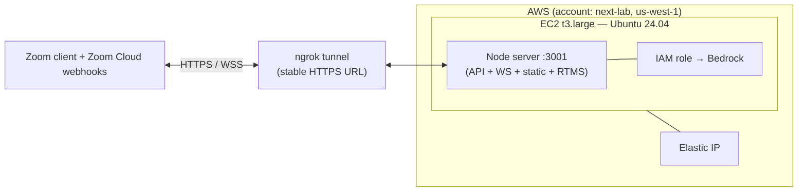

# Zoom Momentum — Technical Deep-Dive

The engineering story behind Momentum: how the system is laid out, how live lecture audio turns into study material, how the AI layer stays cheap without going dark, and how the whole thing runs inside a Zoom client on one EC2 box.

For the product overview and screenshots, see the [README](../README.md).

## The shape of the system

Momentum is one npm monorepo with three workspaces:

| Workspace | Stack | Job |
|---|---|---|
| `client` | React + Vite, `@zoom/appssdk` | The in-meeting UI. One bundle that renders either the Host Dashboard or the Student View depending on your Zoom role. |
| `server` | Express, Prisma, `ws`, `@zoom/rtms`, `@aws-sdk/client-bedrock-runtime` | The API, the WebSocket relay, the transcript pipeline, and every AI call. Also serves the built client. |
| `mock-transcript` | Node | A dev utility that replays a real CS50 lecture into the transcript pipeline so I could build the whole thing without booking a live meeting every time. |

One constraint shapes everything else: a Zoom App is a web page rendered inside the Zoom client's embedded browser. It is not a desktop app, and it is not a normal browser tab. That single fact decides how auth works, how the host and student talk to each other, and why the server is configured the way it is. I will keep coming back to it.

Here is the whole system on one page.



Two things to notice. The host and student never talk to each other directly; every message goes through the relay on the server. And the AI client is the only thing that talks to the model providers, so failover and caching live in exactly one place.

## How the host and student stay in sync

The obvious way to do host-to-student messaging in a Zoom App is the SDK's own `postMessage` / `onMessage`. I built it that way first, and it did not work reliably across the host/attendee boundary. So I replaced it with a plain WebSocket relay through the server, and that turned out to be the better design anyway because it works identically inside Zoom and in a normal browser (which is what makes demo mode possible).

The relay is a room model. The room key is the meeting ID. When a client connects to `/ws?meetingId=...&role=...&participantId=...`, the server drops it into the matching room and relays anything it sends to every *other* socket in that same room.



Every message is a typed envelope (`type`, `payload`, `seq`, `timestamp`, `senderId`, `senderRole`), and the `seq` field is what keeps state consistent. Messages arrive late or out of order over flaky classroom wifi, so the client uses the sequence number to ignore anything older than what it has already applied. State converges instead of flickering.

A few production details that matter more than they look:

- **The relay never trusts the client blindly.** Connections without a meeting ID are closed with code 1008. Payloads are capped at 64 KB. Each socket is rate-limited to 20 messages per second, so a misbehaving or malicious client cannot flood a room.
- **Dead connections get reaped.** A 30-second heartbeat pings every socket; if a socket misses the pong, it is terminated and pulled out of its room. Without this, "ghost" students would pile up in the participant count.
- **The room auto-provisions the meeting.** On connect, the server resolves the meeting ID and creates the `Meeting` row if it does not exist yet, so a student can connect before the host has done anything and the room still works.

The same relay carries everything: poll launches and answers, trivia questions and scores, the "class has ended" broadcast. It is one small file (`server/src/services/websocket.ts`) doing one job.

### Message protocol

All real-time communication uses the WebSocket relay. The server manages rooms by `meetingId` and relays messages between connected clients.

| Message | Sender | Receiver | Purpose |
|---|---|---|---|
| `POLL_START` | Host | Students | Launch a poll |
| `POLL_RESPONSE` | Student | Host | Submit poll answer |
| `POLL_RESULTS` | Host | Students | Broadcast results |
| `ARENA_START` | Host | Students | Begin trivia |
| `ARENA_QUESTION` | Host | Students | Send next question |
| `ARENA_ANSWER` | Student | Host | Submit trivia answer |
| `ARENA_LEADERBOARD` | Host | Students | Show scores |
| `ARENA_END` | Host | Students | Final standings |
| `TOPIC_UPDATE` | Host | Students | New/updated topic |
| `GLOSSARY_UPDATE` | Host | Students | New terms |
| `FULL_STATE` | Host | Students | Late-joiner sync |
| `REQUEST_STATE` | Student | Host | Request full state |

## The transcript pipeline: live audio to study material

This is the part I am most proud of, and it is where the hardest bug lived.

Momentum does not do its own speech recognition. It uses Zoom RTMS (Real-Time Media Streams), which streams transcribed lecture audio to my server as the professor talks. There is a webhook handshake, then a media stream, and a subtle identity problem sitting in the middle.



**The bug that ate a day: two UUIDs for one meeting.** The meeting UUID the Zoom *SDK* hands the client is not the same string as the `meeting_uuid` in the RTMS *webhook*. Same meeting, two different identifiers. So the client would start RTMS, transcripts would flow in and get stored under the webhook's UUID, and then the client would poll for them under the SDK's UUID and get back nothing. Empty transcript, no error, nothing in the logs pointing at the cause.

The fix is a small registration dance. Right before the client calls `startRTMS()`, it POSTs its SDK UUID to `/api/rtms/start`, where the server holds it as `pendingMeetingId`. When the `meeting.rtms_started` webhook lands, the server maps the webhook UUID to that pending client UUID. And as a safety net, when a client polls for transcript under an ID that does not resolve, the server falls back to checking active RTMS sessions and returns their data transparently. The client never has to know there were ever two IDs.

Some details under the hood of the ingest service (`server/src/services/rtms-ingest.ts`):

- **Sequence numbers survive restarts.** Each stored segment gets a monotonic `seqNo`. On the first segment of a session the counter is seeded from the highest `seqNo` already in the database, so reconnecting mid-lecture appends instead of overwriting earlier transcript.
- **Writes are upserts.** Storing on `(meetingId, seqNo)` as an upsert means a duplicated delivery updates in place instead of creating a second copy.
- **Shutdown is graceful.** Active sessions are tracked in a map; on stop or process exit, every RTMS client is told to leave, and "leave" events that fire during a deliberate shutdown are suppressed so they do not get logged as surprise disconnects.
- **The webhook is verified.** Zoom's `endpoint.url_validation` challenge is answered with an HMAC of the plain token, and every other webhook is checked with a constant-time HMAC comparison so the endpoint cannot be spoofed or timing-attacked.

## How the AI layer works

Every AI feature goes through one function: `callAI(prompt, opts)` in `server/src/ai-client.ts`. Polls, trivia, the live topic timeline, the glossary, emphasis detection, the recovery pack, translation, all of it. Funneling everything through one entry point is what makes the failover, the JSON handling, and the caching below possible without repeating myself in seven routes.

### Tiered failover

A classroom tool cannot go dark because one model provider has a bad afternoon. So `callAI` walks a chain and returns the first response it gets:



The primary is Claude 4.5 Sonnet through ASU's CREATE AI gateway. The backup is GPT-5 on the same gateway. The last resort is Llama 3 70B on AWS Bedrock via the Converse API. Each call gets its own `AbortController` timeout (30s for the gateway, 15s for Bedrock), so a hung provider fails fast and the chain moves on instead of leaving a professor staring at a spinner. Bedrock needs no API key, because it authenticates through the EC2 instance's IAM role. That is exactly why it sits at the bottom of the chain: even if every external token is missing or expired, the box can still answer.

### Making an LLM behave like an API

The features need structured data. A poll is a question plus four options; a topic is a title plus bullets plus glossary terms. But models like to wrap their JSON in prose or markdown fences. Two small guards handle that:

- **`extractJSON`** tries a plain parse, then a fenced ```` ```json ```` block, then the first `{...}`, then the first `[...]`. By the time it gives up, the model has had four shots at producing something usable.
- **`sanitizeInput`** strips backticks and backslashes and length-caps every piece of user or transcript text before it enters a prompt, so lecture content cannot break out of the prompt structure or balloon the token count.

The prompts themselves are written defensively. The topic-segmenter is told in detail to return `topicChanged: false` for greetings, audio checks, administrative chatter, or anything that is not actually lecture material. The expensive failure mode here is not a missing topic. It is a glossary full of "the professor said good morning." Temperatures are tuned per task: 0.2 to 0.3 for analysis (topic segmentation, cue detection, translation) where I want determinism, and 0.7 for generation (polls, quizzes) where a little variety helps.

### The Live Anchor loop

The topic timeline is the always-on feature, and it is a polling loop on the client (`useLiveAnchor.ts`) feeding the AI endpoints on the server:



The loop is built to not waste money or step on itself. A re-entrancy guard stops a slow AI call from stacking up overlapping requests. The client diffs the transcript buffer and skips the AI call entirely when nothing new has been said. New glossary terms get merged into the running set rather than re-sent. The timeline feels live, but it only pays for an inference when there is genuinely new lecture content to analyze.

### Translation that scales to a whole class

Students can read the transcript and glossary in six languages (English, Spanish, Chinese, Hindi, Arabic, French; Arabic renders right-to-left). The naive version of this is a disaster, one AI call per student per segment, so the translator (`server/src/services/translator.ts`) is built around a shared cache that does the work once for everyone.



The translation for a given (segment, language) pair is computed exactly once and stored in `TranslatedSegment`; every other student on that language reads it straight from the cache. Uncached segments are sent in batches of ten per AI call. A per-key promise lock means that if thirty students switch to Spanish in the same second, the first request does the translation and the rest await the same in-flight promise instead of all firing duplicate calls. If a batch fails, it falls back to the original English so the transcript never goes blank.

## Auth, security, and the Zoom-shaped constraints

Because the app runs inside Zoom's embedded browser, the server has to satisfy a stricter set of rules than a normal web app:

- **OAuth is PKCE, server-mediated.** The server generates the code verifier and SHA-256 challenge, stores a random `state` in the session, and checks that `state` on the callback before it exchanges the code. Standard PKCE, with the secret never leaving the server.
- **Four security headers are non-negotiable.** Zoom refuses to render the app unless the server sends `Strict-Transport-Security`, `X-Content-Type-Options`, `Referrer-Policy`, and a `Content-Security-Policy`. Miss any one of them and you get a blank panel, not a warning.
- **One origin, served by Express.** In production the built client is served as static files by the same Express process that owns the API and the WebSocket. One origin, no CORS gymnastics inside the meeting. The Vite dev server is fine in a normal browser but does not work inside Zoom, so the app has to be the production build behind the real server.

## How it actually runs

For a Zoom App you need a public HTTPS URL that Zoom can load and that Zoom's webhooks can reach. The deployment reflects that.



The server runs on a single EC2 `t3.large` (2 vCPU, 8 GB) in the `next-lab` AWS account, with an Elastic IP, termination protection, and an IP-restricted security group that only opens SSH and the remote-desktop port to my address. ngrok gives the box a stable public HTTPS URL that Zoom can load and that the RTMS webhooks can call back to.

The instance doubles as a full XFCE desktop with a Zoom client installed and reachable over NICE DCV, so I can run an actual Zoom meeting *on the server* and test the app end-to-end in the real client instead of guessing. The Node server and the ngrok tunnel both run as systemd user services, so they restart on failure and survive reboots. Bedrock access is wired through the instance's IAM role, so the failover floor needs no secrets baked into the box. The machine's identity *is* the credential.
