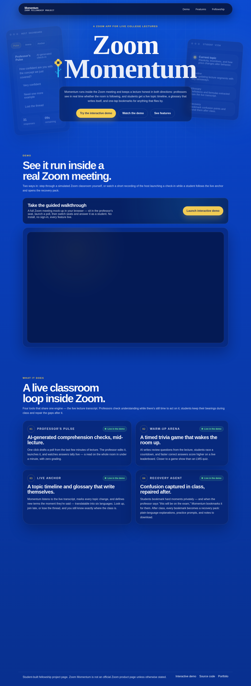

# Zoom Momentum

Zoom Momentum is a Zoom App for live college lectures. It gives instructors lightweight ways to check comprehension during class, and gives students a live orientation layer when a lecture moves quickly.

The product is built around a simple idea: a Zoom lecture should not feel like a passive video stream. Momentum puts a classroom companion inside the meeting itself — polls, warm-up games, live transcript-aware topic tracking, bookmarks, and post-class recovery material.

## Product Story

Zoom Momentum is designed for the moments where students quietly fall behind:

- A professor introduces a new topic and the room has no shared signal for whether it landed.
- A student misses a definition, example, or formula and does not want to interrupt the class.
- A late joiner needs to understand what has happened so far.
- Important moments disappear into the meeting transcript unless someone manually organizes them later.

Momentum keeps that loop inside Zoom. The professor can launch quick checks and review activities, while students get a timeline, glossary, bookmarks, and a recovery pack generated from the moments they marked.

## What The Website Shows

The page is a concise public product overview:

- Hero section introducing Momentum as a Zoom App for live lectures.
- Host and student interface mockups that explain the product split.
- Demo section linking the interactive walkthrough and the recorded demo.
- Feature section for Professor's Pulse, Warm-Up Arena, Live Anchor, and Recovery Agent.
- Fellowship credit section for the ASU Next Lab Zoom Fellowship.

## Core Features Represented

### Professor's Pulse

AI-generated comprehension checks that a professor can edit and launch during lecture. Students answer inside the meeting, and the host sees aggregate results quickly enough to adjust the class.

### Warm-Up Arena

A timed quiz game for review at the start of class. It is meant to make review feel active, competitive, and lightweight rather than like a separate LMS task.

### Live Anchor

A transcript-aware timeline that detects topic changes, summarizes key points, and extracts glossary terms so students can reorient themselves while the lecture continues.

### Recovery Agent

A post-class review flow based on student bookmarks. Confusing moments become plain-language explanations, practice prompts, and suggested resources.

## Repository Contents

- `index.html` - site structure, product copy, metadata, links, and inline SVG/HTML interface mockups.
- `styles.css` - visual system, responsive layout, and animations.
- `script.js` - reveal effects and smooth in-page navigation.
- `favicon.svg` - site favicon.
- `assets/site-preview.png` - current full-page screenshot.
- `assets/README.md` - image inventory and asset guidelines.

## Editing Notes

Keep the site static and fast. The current mockups are built in HTML/CSS rather than exported screenshots so product copy and UI details stay easy to adjust. Use `assets/` for real screenshots, demo posters, or future walkthrough images.
